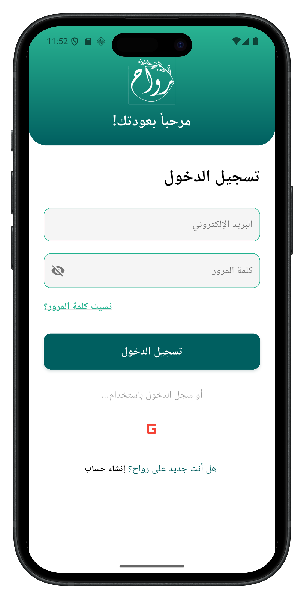
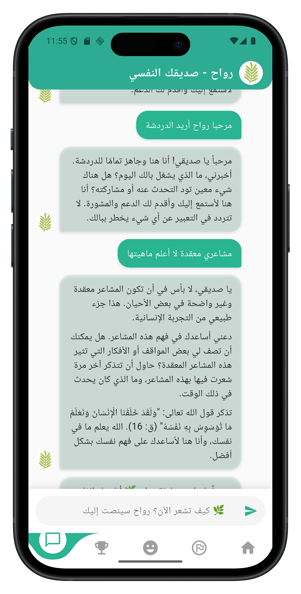
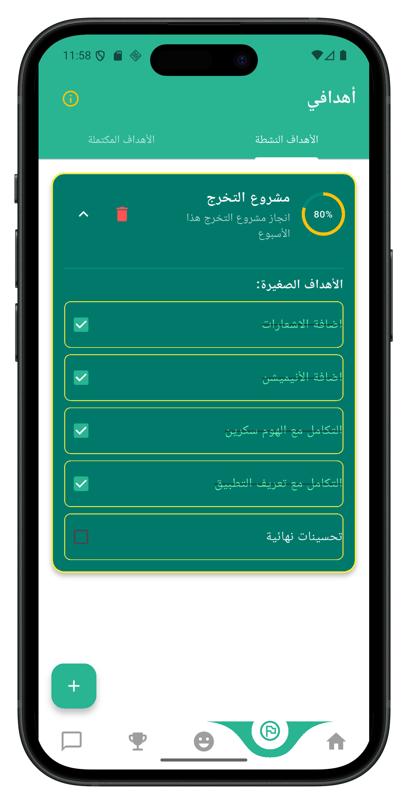
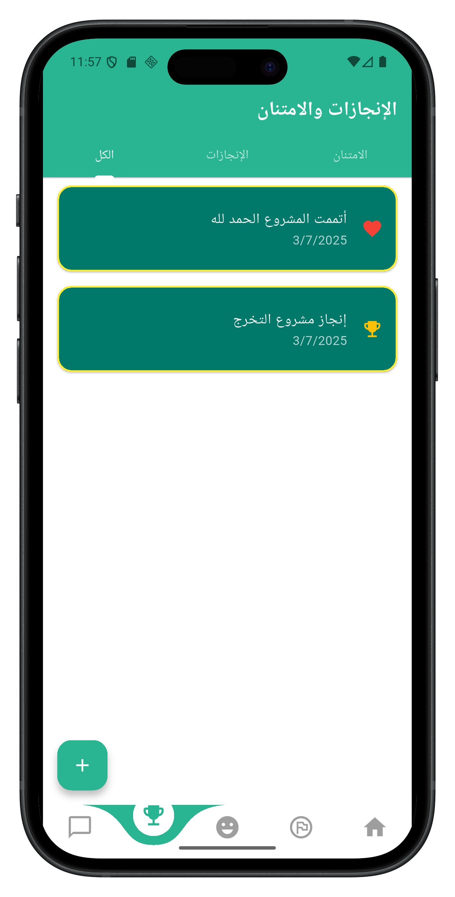

# Rawah | Self-Care & Mental Wellness App

**Rawah** is a mobile application that supports users' mental and emotional well-being through daily mood tracking, achievement logging, spiritual self-care suggestions, and an AI-powered chatbot named **Rawah**, built with Google’s **Gemini Flash API**.

---

> ⚠️ **Disclaimer:**  
> This project is part of a graduation thesis and is intended for demonstration purposes only.  
> The source code is **not to be copied, reused, or distributed** without explicit permission from the authors.  
> Sensitive files such as Firebase configuration, API keys, and core services have been removed or replaced for security reasons.

---

## Project Idea

Many people silently suffer emotionally and need a space to reflect and feel supported.  
Rawah offers a calm and spiritually inspired platform to:

- Log and track emotional states.
- Receive personalized self-care activities.
- Record daily achievements and gratitude.
- Set and track goals.
- Talk with an AI companion who provides gentle emotional and spiritual support.

## Chatbot “Rawah” (Powered by Gemini Flash)

The chatbot is integrated using **Google's Gemini Flash API**, designed to:

- Offer calm, friendly, and emotionally aware conversations.
- Remind users of faith, gratitude, and hope.
- Serve as a virtual companion for venting and reflection.
- Speak in Arabic and respond from a human-Islamic perspective.

## Tech Stack

- **Flutter** – Cross-platform mobile UI toolkit.
- **Firebase**:
  - Authentication – Email/Password sign in, sign up, password reset.
  - Firestore – User data storage (moods, activities, chats).
  - Storage – User profile images.
  - Cloud Functions – Secure Gemini API connection.
- **Gemini Flash API** – AI Chatbot (Rawah).
- **Provider** – State management.
- **Flutter Local Notifications** – Daily reminders.
- **Custom UI** – Arabic RTL-friendly interface.

## Features

- Full Arabic support (Right-to-Left layout).
- Daily **mood tracking** with intuitive emotional selection (positive & negative).
- Built-in **emotion test** to evaluate negative feelings and emotional well-being.
- Personalized **self-care suggestions** based on mood analysis.
- Activity logging with reasons and outcomes.
- Daily **gratitude** and **achievement** journal to boost positivity.
- **Goal setting** and progress tracking for personal growth.
- AI-powered **chatbot** offering faith-based emotional support and listening.
- Push notifications for daily reminders and motivation.
- **User profile customization** (name and email) with persistent storage.

## Team

- **Sohila Arif** – Flutter Developer  
  Responsible for:
  - Full application UI.
  - Authentication and Firebase integration.
  - Emotions page, mood test, and tracking logic.
  - Suggestions engine and activity logging.
  - Achievements, gratitude, and goal tracking.
  - Home page layout and visual design.
  - Chatbot screen and Gemini Flash integration.

- **Asmaa Mohamed Saad** – Settings & Notifications  
  Responsible for:
  - App settings screen and logic.
  - Local notifications (reminders).
  - Profile customization features.

## Other Contributions

We would like to thank the following team members for their background contributions and support throughout the development process:

- **Rofayda Essam**  
- **Mervat Fawzy**  
- **Manar El-Sayed**

Their involvement helped in testing, documentation preparation, and idea validation during different project phases.

## Security

- Gemini API keys are **not included**.
- Firebase configuration files have been **removed** or **mocked**.
- All user data is stored securely in Firestore via authenticated sessions.

## Screenshots

### Login Screen

### Home Screen

### Chatbot Screen

### Mood Tracker

### Goals Page

### Achievements Page

## Contact

- GitHub: [https://github.com/sohilaAreef](https://github.com/sohilaAreef)
- Email: sohilaarif01@gmail.com

---

© 2025 – Graduation Project  
Computer & Systems Engineering – Al-Azhar University
